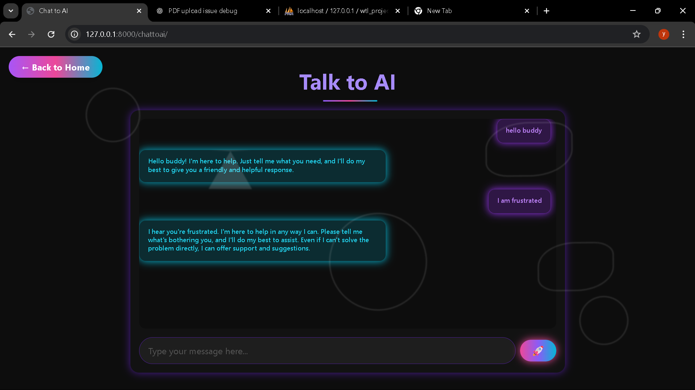
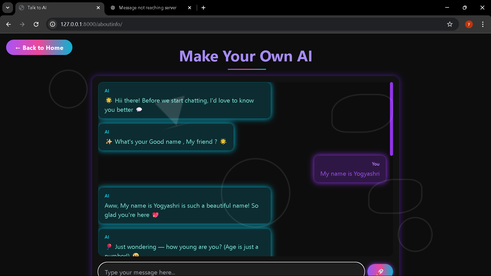
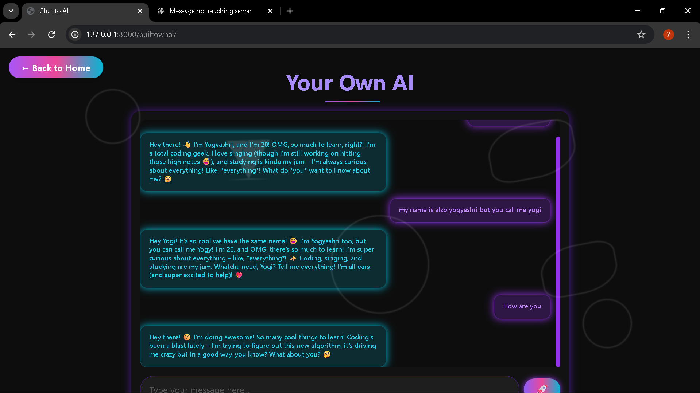

# 🤖 Buddy AI — Your Personalized AI Companion

**Buddy AI** is a smart and flexible AI assistant built with modern technologies. It offers a seamless way to interact with AI in three powerful modes:

---

## 🔹 Features

### 1. 💬 Chat with AI  
Simple and intuitive AI chat for instant conversations.

---

### 2. 🛠️ Build Your Own AI  
Train your own assistant using custom content you provide.

---

### 3. 📄 Chat with PDF (RAG)  
Upload a PDF and ask questions — powered by Retrieval-Augmented Generation.

---

## 🧰 Tech Stack

- **Frontend:** HTML, Tailwind CSS, JavaScript  
- **Backend:** Django  
- **AI Integration:** RAG (Retrieval-Augmented Generation), Custom AI Models

---

## 🔗 Visit My Work  
Check out more at: [github.com/YogyashriPatil](https://github.com/YogyashriPatil)
